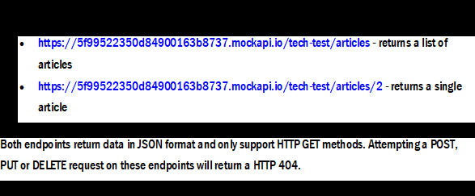

#Project Description:
We have two API endpoints located here:
      

#Setup required:
###Install JAVA (Version used is )
###Download an IDE IntelliJ ( Version used is)
###Setup and Create a Maven Project in IDE with name 'SkySportshouse'

###In POM.xml file add the plugins necessary 
###Plugins required are:
#####TestNG- To run the testcases, 

Added testng.xml file to run the tests

#####RestAssured - plugin used to test APIs and 
#####log4j to log files.

#Project Details
Under the project, SkyEndPointsTestSuite class is created which contains the test cases for both the Endpoints.
Testcase for each request is written.

Contains 4 test cases for Requests GET, POST, PUT and DELETE

In each testcase, RestAssured api is used to send the request and collect the response in Response object.

The Response object contains information like body, header and statuscode

I retrived the required information and printed them in the console output, logs and the testNG html reports.

The TestNG annotation @DataProvider is used to send different values to the test cases.
Here I used two Endpoints as parameters.

#Run the Tests

Run the tests using testNG and the output is displayed in the console.
logs and reports are collected.

#Reports and Logs
##Logs location:
SkySportshouse/logs
##Reports location:
Testng reports in html
SkySportshouse/test-output/html/index.html

